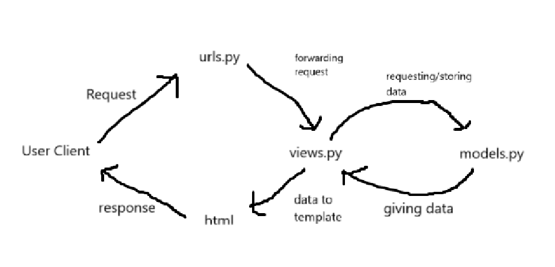
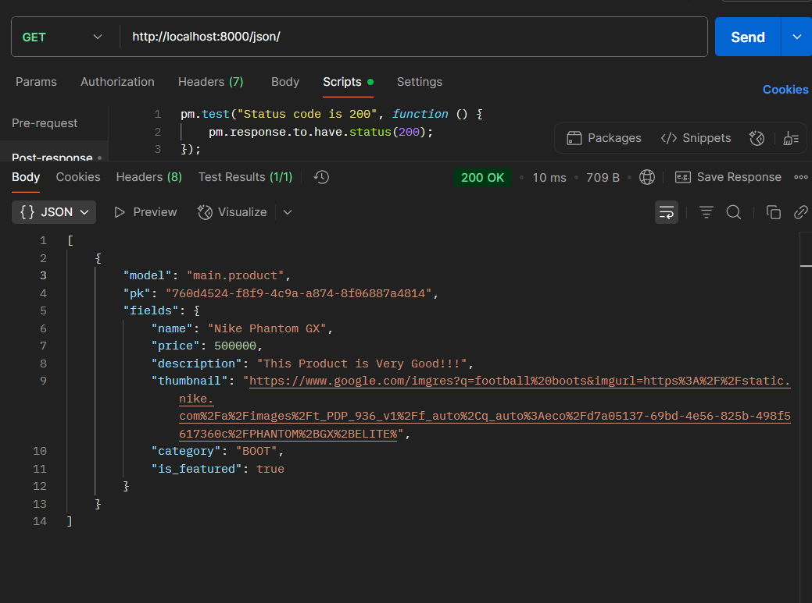
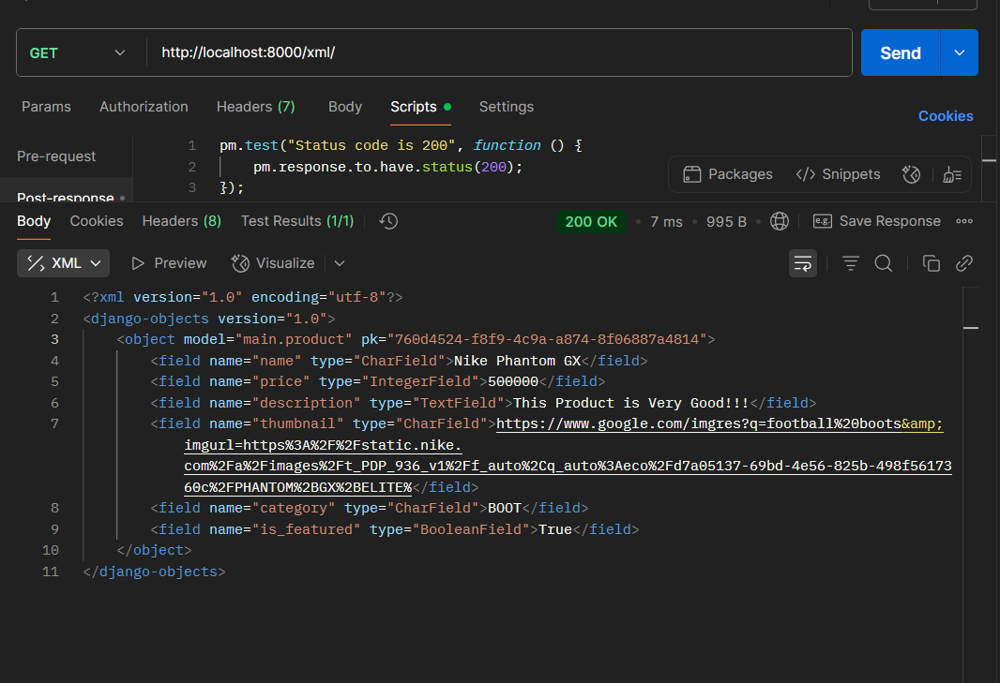
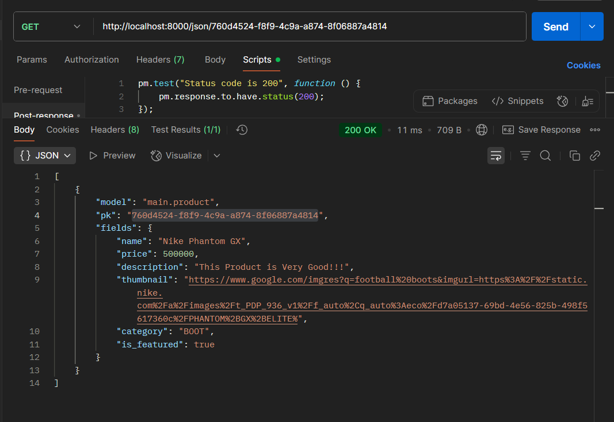
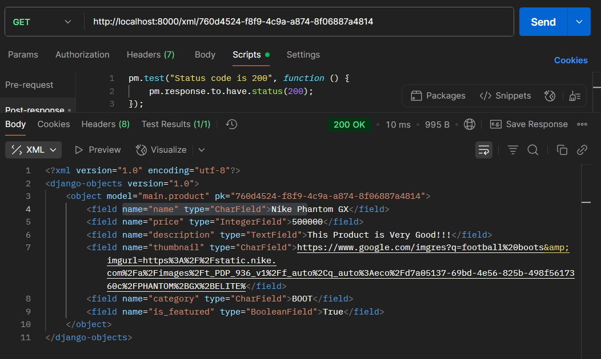

TUGAS 2
1. Mengimplementasikan checklist step-by-step
    - Mempersiapkan repository baru pada GitHub
    - Menyiapkan virtual environment pada terminal 
    - Menyiapkan folder proyek baru bernama "sporta_kuler" dan melakukan install dependencies serta inisiasi Django
    - Melakukan konfigurasi pada .env, .env.prod, serta settings.py
    - Mengunggah proyek ke repository GitHub dengan menambahkan .gitignore
    - Melakukan deployment melalui PWS dan menambahkan URL deployment pws
    - Membuat aplikasi main dalam proyek
    - Membuat model dengan nama porduct pada models.py dan menambahkan atributnya
    - Melakukan migrasi pada model yang baru dibuat 
    - Menghubungkan views.py dengan template
    - Melakukan routing URL aplikasi main

2. Bagan yang berisi request client ke web aplikasi berbasis Django beserta responnya


Penjelasan
User client mengirimkan request ke urls.py melalui browser dan mencocokkan URL dengan view yang sesuai. Setelah URL ditemukan, urls.py meneruskan request ke views.py. Setelah itu views.py menentukan apa yang akan dilakukan seperti mengambil data, proses data atau langsung menampilkan tampilan halaman. Jika membutuhkan data dari database, views.py akan meminta datanya dari models.py. Lalu dari views.py akan meneruskan data yang sudah didapat atau diproses ke html untuk ditampilkan ke user. Html akan mengirimkan response ke user client.

3. settings.py dalam proyek Django memiliki peran penting, yaitu tempat semua pengaturan global proyek Django. Pada settings.py tersimpan berbagai macam pengaturan seperti, penentuan database mana yang dipakai tergantung PRODUCTION, aplikasi mana yang aktif, file & template, siapa yang boleh mengakses, dan konfigurasi keamanan serta konfigurasi tambahaan dijalankan

4. Cara kerja migrasi database dalam Django
Setelah kita menambahkan atau mengubah isi dari model.py ktia akan melakukan migrasi model.
migrasi dilakukan dengan command "python manage.py makemigrations" dan "python manage.py migrate".
makemigrations menciptakan berkas yang berisi perubahan model yang belum diaplikasikan ke dalam basis data.
migrate mengaplikasikan perubahan model yang tercantum dalam berkas migrasi ke basis data. 

5. Menurut saya, kerangka kerja django terorganisasi dengan baik dan mudah untuk diinstall dan belajar. Arsitekturnya yang menggunakan MVT melatih pola pikir dalam software engineering.

6. Materi yang diberikan sudah baik dan lengkap.

TUGAS 3
1. Data delivery memastikan data yang benar, cepat dan aman sampai ke pengguna sehingga platform berguna dan dapat diandalkan

2. Perbedaan JSON dan XML
JSON : Lebih ringkas, struktur key:value bisa langsung dipetakan ke object, parsing umumnya lebih cepat, cocok untuk API
XML : Lebih kuat untuk dokumen markup, memiliki fitur-fitur untuk dokumen yang bersifat dokumen, lebih varbose 

Menurut saya lebih baik JSON tapi JSON dan XML tetap memiliki kelebihannya masing-masing
Alasan JSON lebih populer : Lebih ringan, native di js, parsing lebih sederhana, model datanya cocok untuk API

3. is_valid() adalah method pada instance Form atau ModelForm yang melakukan validasi field, digunakan untuk mencegah data yang tidak valid untuk masuk ke dalam database

4. Fungsi csrf_token adalah mengikat form ke sesi pengguna (atau ke cookie khusus) sehingga server dapat memverifikasi bahwa permintaan POST benar berasal dari halaman yang sah (origin yang benar). Django memeriksa token ini pada setiap request yang berpotensi mengubah state (POST, PUT, DELETE). Jika kita tidak menambahkan csrf_token maka Penyerang dapat memaksa user mengirim request berbahaya (misalnya mengubah data, menghapus resource, melakukan transaksi) dan tindakan yang memerlukan autentikasi bisa dieksekusi tanpa konfirmasi oleh user. Attacker akan memanfaatkan celah dengan cara Membuat halaman eksternal dengan form/action menuju target, otomatis submit via JavaScript untuk metode yang hanya butuh GET/POST sederhana, ini cukup berbahaya. Karena browser otomatis mengirim cookie sesi, server yang tidak mengecek CSRF akan menjalankan aksi.

5. Mengimplementasikan checklist step-by-step
    - Menambahkan beberapa kategori pada models.py 
    - Menambahkan views baru pada views.py : show_xml, show_json, show_xml_by_id, show_json_by_id
    - Menambahkan routing di urls.py ke masing-masing path baru untuk masing-masing view
    - Membuat templates html pada folder main yaitu untuk menampilkan list produk, add product, dan detail product
    - Membuat form tambah product dan membuat view untuk create_product
    - Membuat halaman detail product dan view show_product

6. Feedback untuk asdos, saya masih bingung terkait perbedaan pada data delivery dan bagaimana data dalam bentuk JSON dan XML ini dapat dimanfaatkan dan jika dimaanfaatkan untuk apa

7. Screnshoot 






TUGAS 4
1. Mengimplementasikan checklist step-by-step
    - Membuat fungsi registrasi dengan menggunakan UserCreationForm pada views.py dan membuat template untuk register.
    - Membuat fungsi login menggunakan AuthenticationForm dan mengatur session agar hanya pengguna yang sudah login bisa mengakses halaman tertentu.
    - Membuat fungsi logout menggunakan logout(request) dan mengarahkan kembali ke halaman login.
    - Membuat dua akun pengguna dan menambahkan masing-masing tiga dummy data produk di lokal.
    - Menghubungkan model Product dengan User menggunakan ForeignKey agar data produk terasosiasi dengan pemiliknya.
    - Menampilkan detail informasi user yang sedang login (seperti username) di halaman utama.
    - Menerapkan cookies last_login untuk menyimpan kapan terakhir kali user login, lalu menampilkannya di halaman utama.
    - Melakukan add-commit-push ke GitHub dan deploy ke PWS.
2. AuthenticationForm adalah form bawaan Django untuk autentikasi user. Form ini digunakan untuk login dengan username dan password.

    - Kelebihan: Praktis karena sudah terintegrasi dengan sistem auth Django, aman karena otomatis memvalidasi password.
    - Kekurangan: Kurang fleksibel jika butuh kustomisasi field atau validasi tambahan.

3. Perbedaan autentikasi dan otorisasi

    - Autentikasi: proses memverifikasi identitas pengguna (contoh: login dengan username & password).
    - Otorisasi: proses memberikan hak akses tertentu pada user setelah autentikasi (contoh: admin boleh tambah produk, user biasa hanya bisa lihat produk).
    - Django: autentikasi dilakukan dengan AuthenticationForm, session, dan middleware bawaan. Otorisasi dilakukan dengan permissions, groups, dan decorator seperti @login_required atau @permission_required. 

4. Kelebihan dan kekurangan session & cookies dalam menyimpan state
- Session
Kelebihan : Lebih aman karena data tidak disimpan di browser, hanya ID session yang dikirim.
Kekurangan : Membutuhkan server-side storage sehingga menambah beban server.

-Cookies
Kelebihan : Tidak membebani server karena data disimpan di browser.
Kekurangan : Lebih rawan diubah user atau dicuri.

5. Apakah cookies aman secara default?
    Tidak sepenuhnya aman, ada risiko XSS dan session hijacking. Django menangani hal ini dengan:
    - Menggunakan flag HttpOnly agar cookie tidak bisa diakses lewat JavaScript.
    - Mendukung Secure flag agar cookie hanya dikirim lewat HTTPS.
    - Memberikan CSRF Token untuk mencegah serangan CSRF.

TUGAS 5
1. Jika terdapat beberapa CSS selector untuk suatu elemen HTML, urutan prioritasnya ditentukan oleh spesifisitas selector. Urutannya: inline style > ID selector > class/attribute/pseudo-class selector > element/tag/pseudo-element selector. Jika spesifisitas sama, maka selector yang ditulis terakhir di CSS akan diterapkan.

2. Responsive design penting agar tampilan web tetap optimal di berbagai ukuran layar (desktop, tablet, mobile). Contoh aplikasi yang sudah menerapkan: Instagram (tampilan menyesuaikan layar). Contoh yang belum: situs lama dengan layout tetap, sehingga sulit digunakan di ponsel. Responsive design meningkatkan pengalaman pengguna dan aksesibilitas.

3. Margin adalah jarak luar elemen ke elemen lain, border adalah garis tepi elemen, padding adalah jarak antara border dan isi elemen.

Implementasi CSS biasa:
```css
.box {
    margin: 10px;
    border: 2px solid black;
    padding: 8px;
}
```

Contoh implementasi pada HTML dengan Tailwind CSS:
```html
<div class="m-2 border-2 border-black p-2">
  Konten di sini
</div>
```
Pada contoh di atas:
- `m-2` untuk margin,
- `border-2 border-black` untuk border,
- `p-2` untuk padding.

4. Flexbox adalah layout model untuk mengatur elemen dalam satu dimensi (baris/kolom) secara fleksibel, cocok untuk navbar, card, dsb. Grid layout adalah model dua dimensi untuk membuat layout kompleks dengan baris dan kolom, cocok untuk galeri atau dashboard. Keduanya memudahkan pembuatan layout responsif dan terstruktur.

5. Mengimplementasikan checklist step-by-step
- Menambahkan fungsi untuk menghapus dan mengedit product dengan cara pada views.py menambahkan edit_product dan delete_product, menambahkan edit_product pada template serta manambahkan path edit dan delete di urls.py
- Dengan menggunakan tailwind saya melakukan kustomisasi desgin, awalnya pada base.html menambahkan tailwind, lalu untuk setiap template yang ada melakukan kustomisasi design dan menambahkan suatu navbar.
- Menambahkan jika tidak ada produk untuk ditampilkan ada gambar dan pesan productnya belum ada
- Nambah card untuk show tiap productnya
- Membuat navbar yang responsif serta merespon perbedaan device, jika mobile pakai hamburger

TUGAS 6
1. Mengimplementasikan checklist step-by-step
- Mengubah seluruh fitur CRUD product menjadi berbasis AJAX (Fetch API + JSON)
    - Membuat endpoint Django yang mengembalikan JsonResponse untuk operasi Create / Read / Update / Delete.
    - Pada server (views.py): memproses form validasi (use ProductsForm) dan mengembalikan JSON berisi { success: true, message: "...", data: {...} } atau { success: false, errors: {...} }.
    - Pada client (JS): menggunakan fetch() dengan method: "POST" untuk create/update/delete, mengirim FormData dan header X-Requested-With: "XMLHttpRequest" serta X-CSRFToken (atau menggunakan cookie CSRF).
    - Tidak lagi menggunakan render penuh (render(...)) untuk hasil CRUD — render hanya dipakai untuk menampilkan template utama; semua interaksi CRUD dilakukan AJAX + DOM update.

- Mengubah Login dan Register menggunakan AJAX
    - Login/register view tetap menggunakan AuthenticationForm / UserCreationForm server-side untuk validasi.
    - Jika request AJAX: view mengembalikan JsonResponse (success / errors). Jika non-AJAX: tetap bisa berfungsi normal (degradasi).
    - Frontend: form login/register menangani submit JS, memanggil fetch() lalu menampilkan pesan di halaman dan memicu toast, serta redirect jika login berhasil.

- Tampilan baru
    - Modal untuk create & update product (form dimasukkan ke dalam modal). Modal membuka form via DOM (innerHTML) atau mem-fetch partial HTML via AJAX.
    - Modal konfirmasi untuk delete (confirm modal). Pada confirm -> lakukan AJAX delete.
    - Tombol refresh yang memanggil endpoint JSON untuk load ulang list product tanpa reload halaman.
    - States: Loading, Empty, Error dibuat dan di-toggle melalui JS berdasarkan hasil fetch/response.
    - Toast notifications dibuat (kustom design) dan dipanggil untuk event: create, update, delete, login, logout, register.

- Modal & refresh & live update
    - Create / Update form berada di modal; setelah submit sukses:
    - Tutup modal (hideModal()),
    - Tampilkan toast (success),
    - Dispatch custom event productAdded / productUpdated sehingga main.html mendengarkan dan memanggil ulang fetchProductsFromServer() untuk me-refresh list.
    - Delete menggunakan modal konfirmasi; setelah konfirmasi => AJAX delete => dispatch productDeleted event (atau langsung refresh list).
    - Tombol “Refresh” memanggil ulang fetchProductsFromServer() tanpa reload page.

- Loading, Empty, Error state via JS
    - displayPageSection({ showLoading, showError, showEmpty, showGrid }) untuk kontrol UI.
    - Saat fetching, tampilkan loading spinner; jika data kosong tampilkan empty state; jika error tampilkan error panel.

- Toast
    - Toast kustom (HTML+CSS+JS) yang memiliki icon, title, message, progress-bar, close button.
    - Dipanggil dengan showToast(title, message, type) atau wrapper callShowToast() yang menunggu showToast tersedia.
    - Menampilkan toasts berbeda untuk tiap aksi (create: success hijau, update: info/blue, delete: warning/kuning, login/register: success/error sesuai hasil).

2. AuthenticationForm adalah form bawaan Django untuk autentikasi user

- AuthenticationForm adalah form built-in Django yang mem-validasi username & password dan menyediakan helper untuk mendapatkan user yang terautentikasi (mis. form.get_user()).

- Kelebihan:
    - Praktis karena sudah terintegrasi dengan backend auth Django.
    - Aman: otomatis memvalidasi password menggunakan backend yang disetel, mendukung hashing password, tidak perlu menulis validasi manual.

- Kekurangan:
    - Kurang fleksibel untuk kebutuhan kustom yang sangat spesifik (mis. field tambahan, login via email + phone, reCAPTCHA, dsb.) — walau masih bisa di-extend.

3. Perbedaan synchronous request dan asynchronous request
- Synchronous request (sinkron):
    - Browser mengirim request dan “menunggu” response; selama itu UI biasanya terblokir atau berpindah ke halaman baru (full page reload).
    - Contoh: form submit biasa yang mengakibatkan render() balik ke template baru.

- Asynchronous request (AJAX):
    - Browser mengirim request tanpa memblokir UI; hasil diproses di background dan DOM diubah dengan JS tanpa reload.
    - Contoh: fetch() yang mengembalikan JSON dan kemudian JS meng-update bagian halaman.

- Perbedaan utama:
    - UX: AJAX lebih halus (tidak reload), sinkron mengganggu alur pengguna.
    - Performance: AJAX bisa hemat bandwidth (mengambil JSON + fragment), sinkron sering meminta seluruh halaman kembali.
    - Complexity: AJAX membutuhkan lebih banyak kode client-side (JS), sinkron lebih sederhana karena server-side render.

4. Bagaimana AJAX bekerja di Django (alur request–response)

- Client (browser): trigger (klik tombol, submit form) -> JS membuat fetch() atau XMLHttpRequest.
- Request: JS mengirim request ke URL Django (mis. /product/add/), sering dengan header X-Requested-With: XMLHttpRequest dan menyertakan token CSRF.
- Server (Django view):
    - Menerima request, melakukan autentikasi/authorization (jika perlu).
    - Memproses request.POST / request.FILES menggunakan form (ProductsForm, AuthenticationForm, dsb.).
    - Jika request adalah AJAX (client meng-set header), view mengembalikan JsonResponse berisi { success: true/false, message, errors, data }.
    - Jika bukan AJAX — view dapat merender template HTML biasa atau redirect (backward compatibility).
- Client:
    - Menerima response JSON, JS mem-parsing response.json().
    - Berdasarkan success atau errors, JS memperbarui DOM: menampilkan toast, menutup modal, atau menampilkan error message di form.
    - Jika action mengubah data (create/update/delete), JS dapat mem-dispatch custom event (mis. productAdded) supaya komponen lain (list/grid) tahu untuk refresh data.
- Secara opsional: client memanggil endpoint list JSON (mis. /products/json/) untuk menampilkan list terbaru tanpa reload.

5. Apa keuntungan menggunakan AJAX dibandingkan render biasa di Django?
- User Experience lebih baik: halaman tidak reload, transisi terasa cepat & mulus.
- Hemat bandwidth: hanya transfer data (JSON) atau fragment HTML, bukan seluruh halaman.
- Interaktivitas: bisa menampilkan loading/inline-validation/toast tanpa interrupt page.
- Real-time feel: memungkinkan partial updates, polling, atau push updates (websocket) lebih mudah terintegrasi.
- Fleksibilitas UI: front-end dapat mengatur DOM persis sesuai keinginan tanpa menggantung pada server-side templates


6. Bagaimana cara memastikan keamanan saat menggunakan AJAX untuk fitur Login dan Register di Django?
- Gunakan CSRF Token:
    - Saat mengirim POST lewat AJAX, sertakan CSRF token. Cara umum: ambil token dari cookie (csrftoken) dan set header X-CSRFToken.
    - Atau ambil dari <input type="hidden" name="csrfmiddlewaretoken"> dan kirimkan sebagai field pada FormData.
- Selalu validasi server-side:
    - Jangan hanya mengandalkan validasi di client. Gunakan AuthenticationForm / UserCreationForm untuk validasi di view.
    - Kembalikan error terperinci sebagai JSON bila invalid.
- Gunakan HTTPS:
    - Pastikan situs berjalan di HTTPS agar cookie dan credentials tidak bocor.
- Set cookie flags:
    - SESSION_COOKIE_SECURE = True (hanya dikirim di HTTPS), SESSION_COOKIE_HTTPONLY = True (tidak dapat diakses oleh JS), CSRF_COOKIE_SECURE, CSRF_COOKIE_HTTPONLY (sesuaikan).
- Proteksi brute-force:
    - Batasi percobaan login (rate-limiting), gunakan throttle atau third-party libs seperti django-axes.
- Gunakan built-in auth methods:
    - Gunakan django.contrib.auth.authenticate() dan login() untuk session management.
- Validasi input ekstra:
    - Untuk register: periksa kekuatan password (Django password validators), konfirmasi password, cek uniqueness username/email.
- Tidak menampilkan informasi sensitif:
    - Jangan memberikan pesan yang mengungkapkan apakah username ada atau tidak (sesuaikan kebijakan UX/security).
- Escape/serialize data:
    - Ketika menampilkan data dari server ke DOM, gunakan textContent atau sanitasi untuk menghindari XSS jika memasukkan user-generated content.

7. Bagaimana AJAX mempengaruhi pengalaman pengguna (User Experience) pada website?
- Lebih responsif: aksi terasa cepat karena tidak perlu reload seluruh halaman.
- Lebih interaktif: bisa menampilkan feedback instan (loading spinner, inline validation, toast).
- Lebih modern & polished: UX terlihat seperti SPA (Single Page App) pada beberapa bagian.
- Konsistensi state: pengguna tetap berada di satu halaman — navigasi lebih lancar.
- Risiko: jika tidak di-handle baik, bisa terjadi inconsistent UI (mis. data stale) — solusinya polling, event dispatch, atau update afte   r actions.
- Aksesibilitas: perlu perhatian (focus management, aria-live untuk notifikasi) agar pengguna screen reader tetap tahu perubahan.